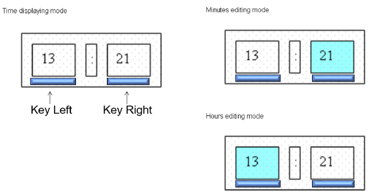
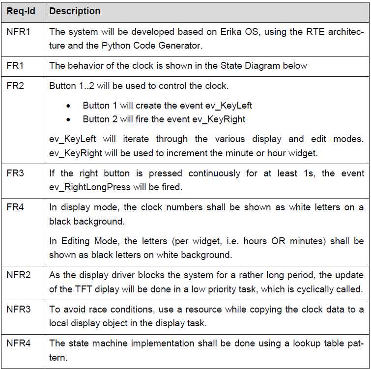
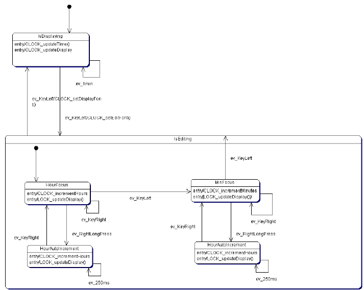
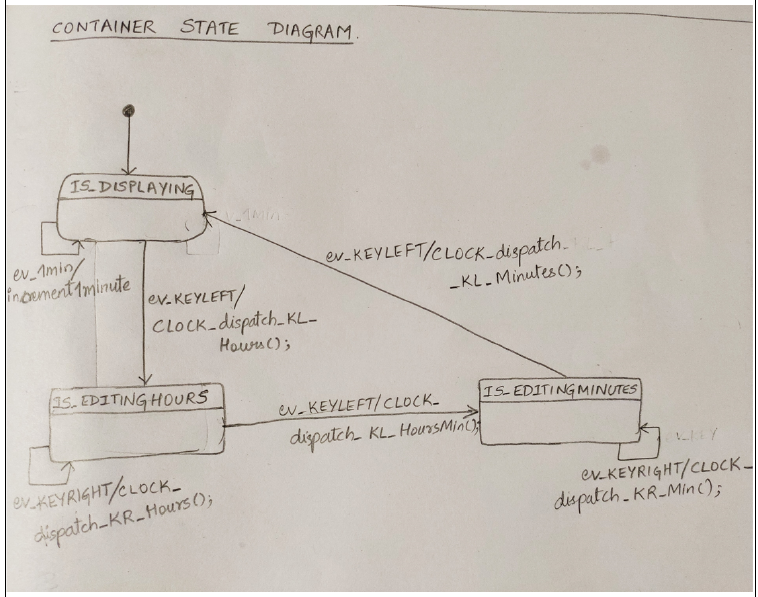
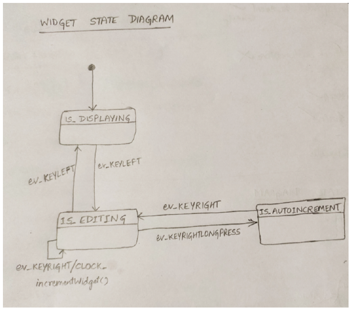
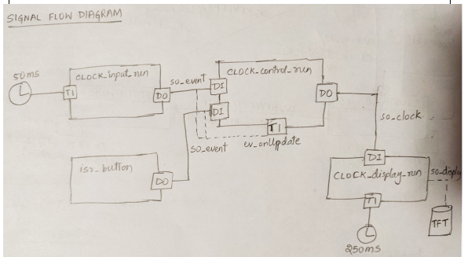
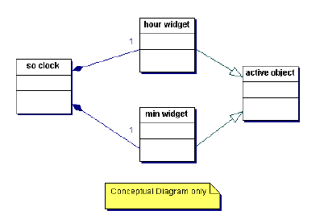

# ELECTRONIC CLOCK #

Learning focus is the implementation of a more complex statemachine design using **Active-Object Pattern**. We will use the TFT display and need to develop a complex device driver for showing the time.

A possible strategy to arrive at the solution could be -
-   Create Flat State Machines using the Active Object Pattern
-   Analyze the events and check where they will be fired (by an Alarm, another task, an ISR, the RTE…)
-   Design the signal flow considering the identified event sources (please check the annex on the diagram conventions)
-   Implement the state machines and active objects (use UART_LOG com-mands to create some verbosity)
-   Add the TFT display driver.

## Requirements ##

## Heirarchical state diagram

## Container state diagram ##

## Widget state diagram ##

## Signal Flow ##

We will use the RTE pattern to implement the clock. The clock state machine runnable(s) will be executed in the event task, the dis-play runnable as well as the input runnable, which will create e.g. the longPress event and other time based signals will be executed in the cyclic task.

Analyse the concept for critical sections and add resources where needed.

## Implementation ##

For the implementation of the state machine, use one of the Lookup table patterns.

Use the RTE Generator to create the code framework.
For the clock, you may implement 1 or 2 signals
-   1 signal: You have to copy the *clock* signal payload to a local variable in your display runnable and call the TFT display driver (straight forward)
-   2 signals: Copy the content from your *clock* signal to your *clock_display* signal in the display runnable and use the *clock_display pushPort()* to write the data to the TFT driver (a bit more elegant)

Hint: The *clock signal* should contain the data structures for the *hour* and *minute* widget as compositions. I.e.

## Test ##

Create systematic testcases using state machine test strategy